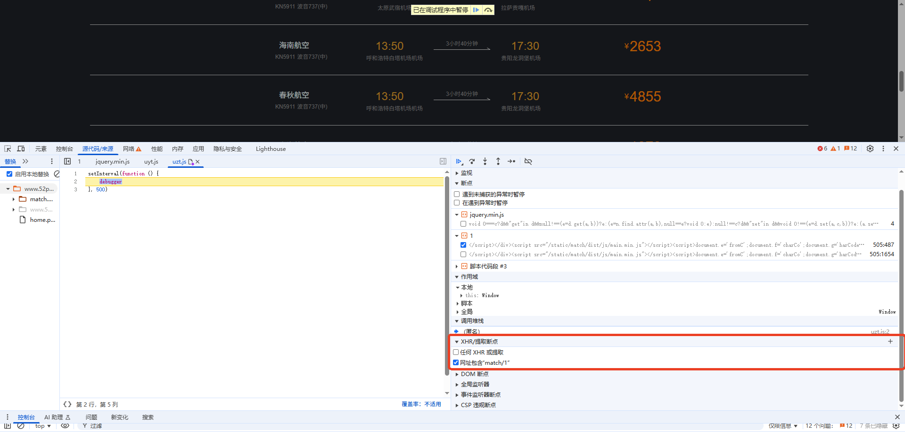
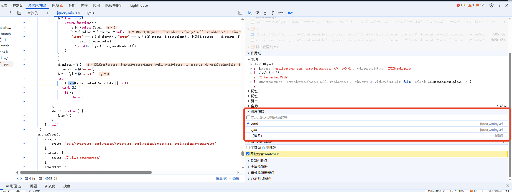
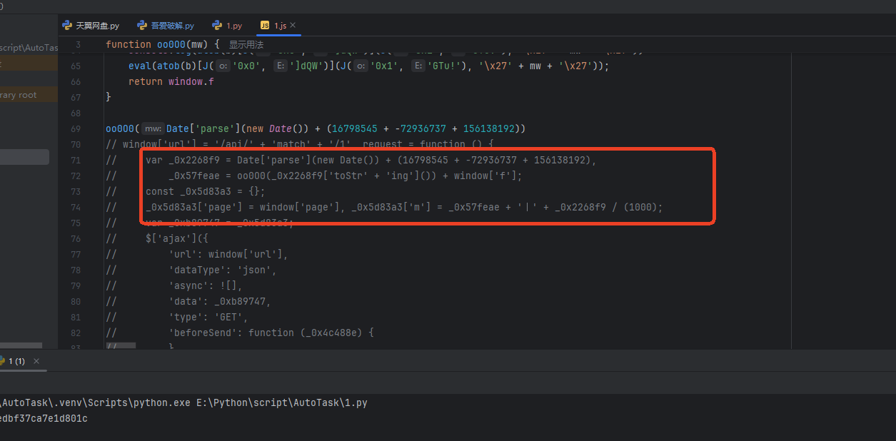
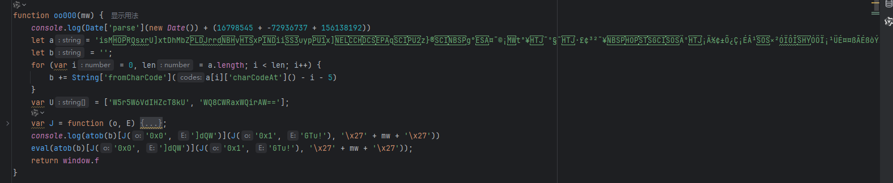
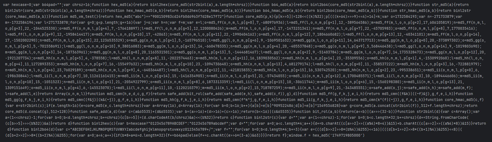
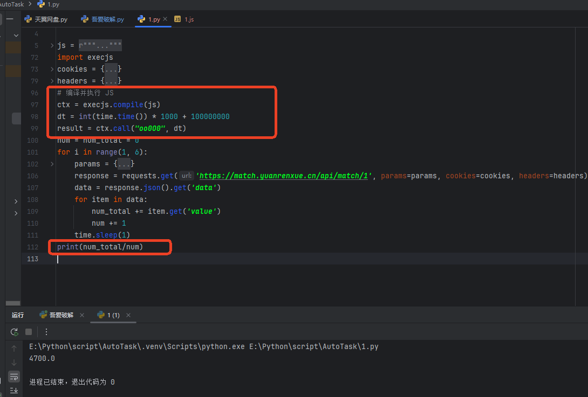

[js混淆-源码乱码](https://match.yuanrenxue.cn/match/1)
# 解题步骤
### 1.捕获相关请求
        通过网络界面可知，请求接口为：https://match.yuanrenxue.cn/api/match/1所以我们可以通过XHR/提取断点功能来捕获该请求，如下图：

### 2.调试分析代码
        捕获后发现调试堆栈只有三步，我们通过对每一步调试发现，只有在匿名方法中没看到m，但是发现里面没没有js代码，只有一部分js字符串，copy出来发
    现是通过eval()方法执行的，我们通过将代码进行ascll解码，然后在通过utf8解码，获得源码：

### 3.分析源码
        通过对源码发现，代码是调用一个名叫oo0O0函数来获取m值得，传递的参数为当前时间戳+100000000后的时间戳，然后通过oo0O0函数获取m值，
    然后我们找到上边的oo0O0函数：
```javascript
var _0x2268f9 = Date['parse'](new Date()) + (16798545 + -72936737 + 156138192),
_0x57feae = oo0O0(_0x2268f9['toStr' + 'ing']()) + window['f'];
```

### 4.oo0O0函数源码
        观察发现，完全看不懂里面是干嘛的，怎么获得的m值，但是我们可以声明一个window=this变量，然后将之前构造的时间戳放进去运行改代码，发现缺少部分变量，  
    window的a,b,c,h,e,f,g,我们将浏览器断点打到该地方，取消其他断点，发现这几个值固定，so，不纠结这几个值怎么形成的，copy，直接copy就行了，
    只要copy了，就是我们的，然后代码可以成功运行了，但是还没完，因为运行完生成了一堆乱码，真狗啊，这乱码谁认得出来啊，好吧，到此结束了

### 5.解决乱码困境
        虽然认不得乱码是啥，但是我查了一下atob() 的作用，呕吼，原来是js的解码动作呀，那咱们直接对这对乱码解码一下不就行了么，原来是一串js代码，脑壳大啊
    粗布观察一下，好似md5加密，但是又感觉不那么像呀，而且这串代码好像还运行不了，但是仔细观察发现代码最后好像将值赋给window.f，我们是不是可以直
    接调用window.f，发现可行，致此本题解决成功：

###  6.最后
    可以直接copy代码让python调用了，运行结果如下：

