[js 混淆 - 动态cookie 1](https://match.yuanrenxue.cn/match/2) 
[参考链接](https://blog.csdn.net/Yy_Rose/article/details/126854940)
# 解题步骤
### 1.捕获相关请求
        通过网络界面可知，请求接口为：https://match.yuanrenxue.cn/api/match/2所以我们可以通过XHR/提取断点功能来捕获该请求，发现cookie
    中m值过一段时间就会更改一次，但是没有任何请求发出，如下图：

### 2.问题思路
        通过fiddler抓包也抓不到cookie值为m的请求，cookie值变动但没有请求，那真相可能有几种，但这个真相就是本地动态生成的cookie，以此来达到
    验证cookie的请求，所以我们开始调试https://match.yuanrenxue.cn/match/2请求，发现过一段时间，需要刷新一次页面，在第二次刷新的时候，
    页面的cookies上面已经带上了新的m值，如下图：
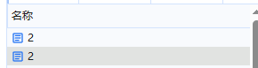
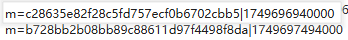
### 3.问题分析
        既然页面刷新就会获取新的m值，那m值可能就是页面刷新时，动态生成的，而且m值后面跟的像时间戳，那么我们开始调试页面，发现页面刷新时，完全找
    不到m生成的痕迹，有坑啊？ 明明思路都是正确的，为啥找不到呢？那睡大觉吧。
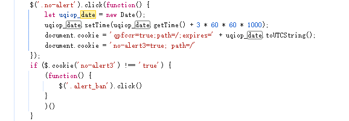
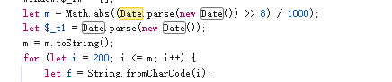
### 4.思路调整
        m值并非请求得到的，那肯定是通过js代码生成的，但是在源码界面没有找到相应的代码，调试过程中也找不到相应的方法，只能百度了，这个是我参考的
    一个链接https://blog.csdn.net/Yy_Rose/article/details/126854940,开始根据这个步骤走。

##### **图1**

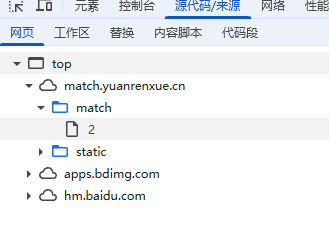
##### **图2**

##### **图3**
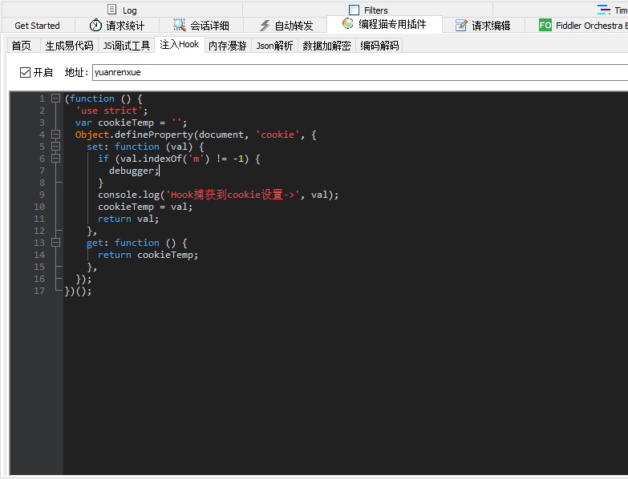
### 5.万事具备，只欠调试
        通过该方法发现了隐藏的js代码，原来如此，动态生成了一份js代码，然后再生成m值，我怎么说一直找不到生成m值相应的js文件呢，原来不是我们菜，
    而是对方太狗了，开始分析隐藏文件的代码，emmmm。。。。，看不懂，老表表示看不懂，但是应该是ob混淆吧，我这面没和作者一样直接使用源代码，而是通过
    ob解混淆来获取原始代码，https://tool.yuanrenxue.cn/decode_obfuscator（猿人学官方链接），获取了一份源码，先删除定时器，这玩意不
    是好东西，然后再分析源码，通过调试已知m值生成函数function _0x5a6184，我们可以直接在解混淆后的源码中搜索，发现是通过时间戳生成的m值，但是该
    函数在自执行函数里面怎么处理，当然是取消自执行函数，单独调用该函数，将时间戳传递给该函数，会出现报错，我们需要注释掉如图5的那个函数（函数名会
    变，但位置不变），然后将qz列表提取到公共变量，在运行后生成m值，简化函数之后如下，
##### **图1**
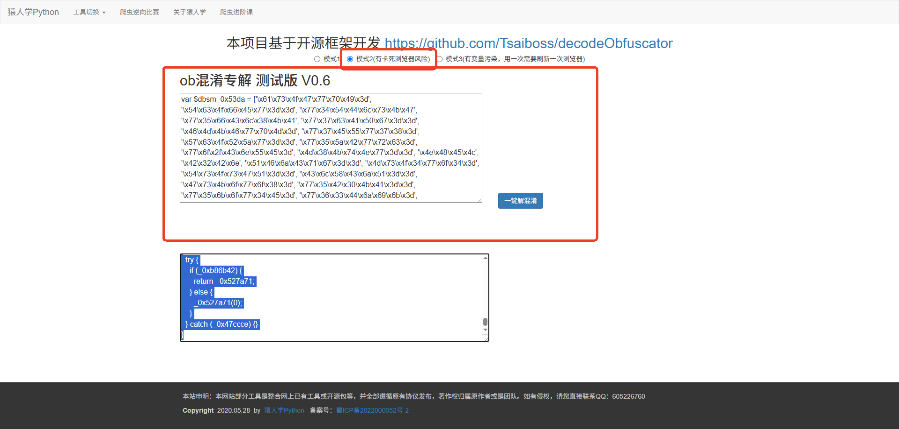
##### **图2**
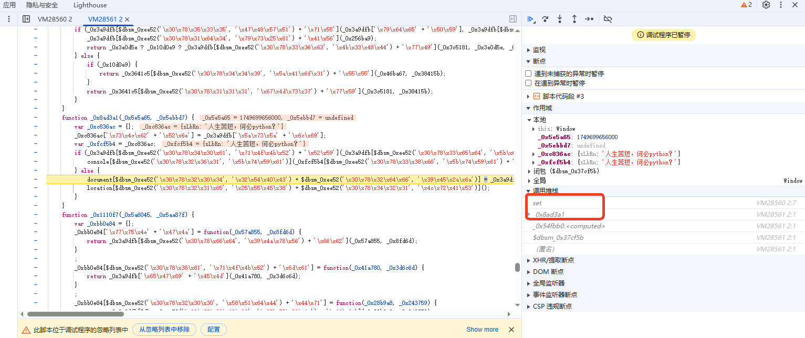
##### **图3**
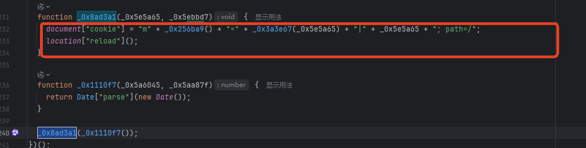
##### **图4**
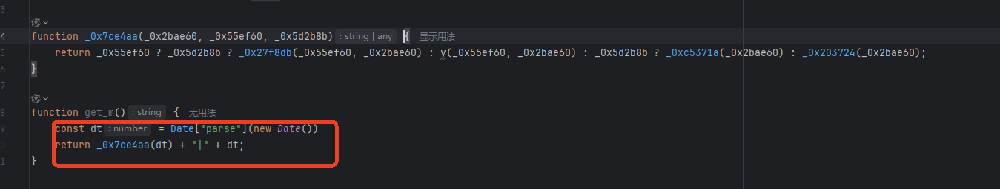
##### **图5**
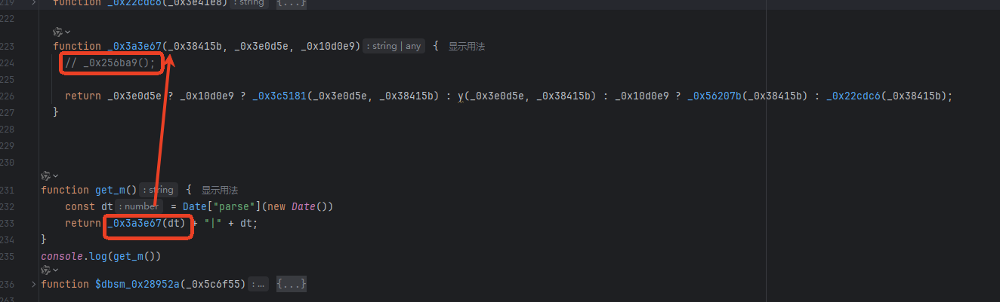
### 6.打完收工
        本体主要是是如何获取动态执行的js脚本