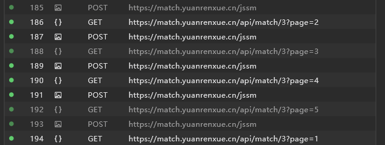
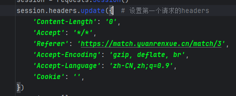

[js 混淆 - 动态cookie 1](https://match.yuanrenxue.cn/match/3) 
[参考链接](https://blog.csdn.net/fre_free/article/details/134668530)
# 解题步骤
### 1.捕获相关请求
        通过网络界面可知，请求接口为：https://match.yuanrenxue.cn/api/match/3所以我们可以通过XHR/提取断点功能来捕获该请求，发现cookie
    中sessionid值过一段时间就会更改一次，然后发现每次请求都会重置一下sessionid，并且请求前会有个一额外的请求/jssm

### 2.问题思路
        可知每次请求都需要重置一下sessionid，按照该思路，我们需要先请求一下/jssm，重置一下sessionid之后再请求/match/3，恭喜你，报错了，
    因为直接从浏览器复制的curl是用不了，通过百度发现该请求会对请求头进行校验，故此，我们需要查看请求头排序问题及所需的请求头，
    
### 3.问题分析
        通过不断试错，找到了正确的请求头及顺序（其实可以更具浏览器请求一个一个copy），也可以请求的同，但是我们一般通过curl功能，会造成部分请求头
    丢失，所以这里我们通过浏览器请求一个一个复制下来，然后每次减少一个，直到找到正确的请求头及顺序，请求成功
