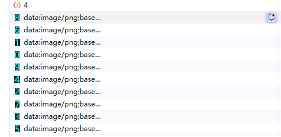
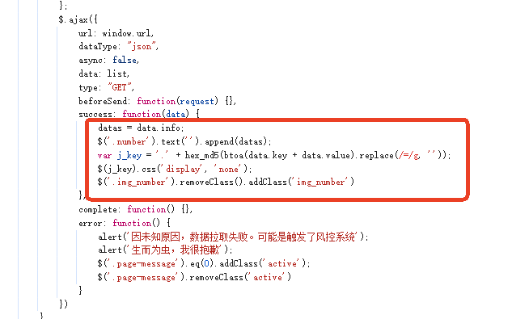
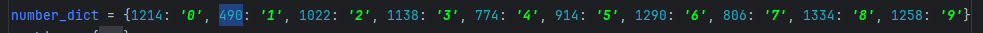
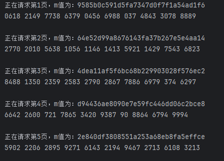
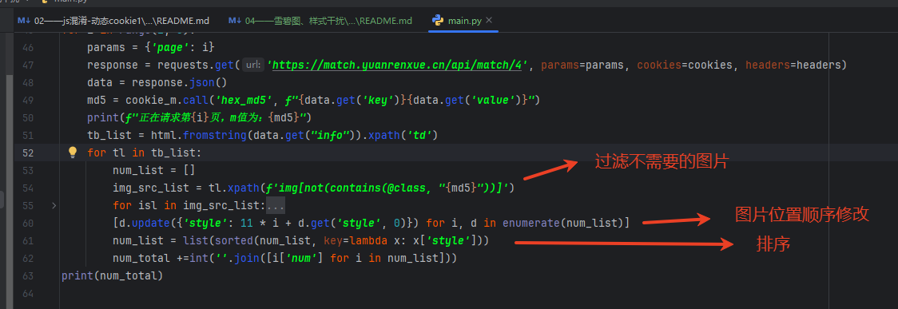

[js 混淆 - 动态cookie 1](https://match.yuanrenxue.cn/match/4) 
# 解题步骤
### 1.捕获相关请求
        通过网络界面可知，请求接口为：https://match.yuanrenxue.cn/api/match/4，获取结果后突然发现，返回的是撒呀，为啥现实的数字，返回的像是
    html页面，然后点了一下数字发现，他是已图片形式显示的，某得办法，开始找规律

## 2.问题思路
        通过xhr断点可以很快找到请求位置，然后看到请求后会根据hex_md5生成一个值，然后屏蔽一些图片，来达到显示成数字的目的，copy相应代码，感觉还
    蛮简单的呀，通过请求加上hex_md5过滤，很容易找到所需的图片链接，但我怎么把它变成数字呢，总不能一个一个肉眼识别吧，emmmm.，最后发现每张图片
    链接的数字和链接是固定的，我们可以做一个映射，我这边是根据链接长度来映射相应的数字的，

## 3.解决方法
        请求和数字映射关系都搞好了，我们来拼数字吧，但是好像拼的数字和页面差距很大，问题出在了那里，我是按照顺序拼的呀，看着页面也是的，

## 4.问题解决
        通过观察，发现图片位置并非根据标签顺序定的，而是根据style="left:和图片位置一起决定的，bingo，大功告成
