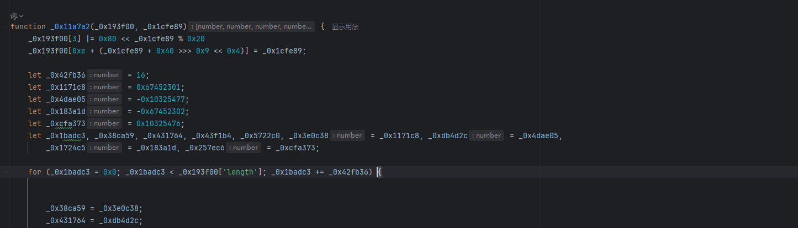

[js 混淆 - 乱码增强](https://match.yuanrenxue.cn/match/5) 

# 解题步骤

### 1.捕获相关请求

        捕获相关请求，发现根本找不到相应的参数及cookie值，so，代码可能在虚拟机里面运行的，我们需要通过hook注入来获取代码实际cookie生成的位置,
    通过注入，已经找到了cookie的位置，我们点进去便是虚拟机

### 2.问题思路

        进去发现cookie早已生成，存在_$ss里面，这怎么处理，总不能一次一次调试找这个值吧，这个时候就需要我们修改注入代码了,不难发现_0x4e96b4是
    window，故此需要抓window中的_$ss变量，通过该方法很轻松找到了该值，如下图

### 3.问题分析

        突然发现我们找到了加密方法，nice，通过替换里面的值发现该加密方法是aes加密，我们目前只需测试是否是标准的aes加密即可，通过实验发现是标准的
    aes加密

### 4.加密参数整理
        接下来我们开始找明文及密文的生成过程，通过查看可知明文为：0x4e96b4['_$pr'][_$UH[0x1f]]()，密文为：_0x4e96b4[_0xc77418('0x6', 'OCbs')]
    我们跟踪这两个变量'_$pr'和'_$qF'，可知'_$qF'的来源为'_$is'，搜索'_$is'发现有多处，在此处我们也发现了'_$pr'的踪迹，我们都打上断点,进行调试，
    发现有一个地方一下子塞入了四个'_$pr'值，然后另一个地方却塞入了一个'_$pr'值，并且该地方还对'_$is'进行了赋值，即最'_$pr'有一个值和'_$is'
    是有关系的，继续进行调试,发现'_$pr'是由哪两个地方生成的，而且是通过对时间戳加密进行的，加密函数为_0x474032

### 5.扣加密函数
        先把_0x474032扣下来，然后查看需要什么函数，一点一点扣，扣完之后发现需要_0x4e96b4其中一些变量，然后对这些变量进行一一替换即可，然后对
    _0x11a7a2该函数代码研究简化了一下，

### 6.打完收工
        运行后发现可以生成相应的加密，且没有任何报错，然后将加密代理请求中，发现请求不通，是因为他在机密过程中将一下三个值在第五次时间加密做了一下
    替换，找到第五次加密过程中的这三个值就可以了
