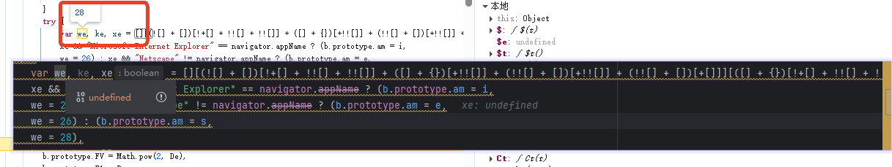
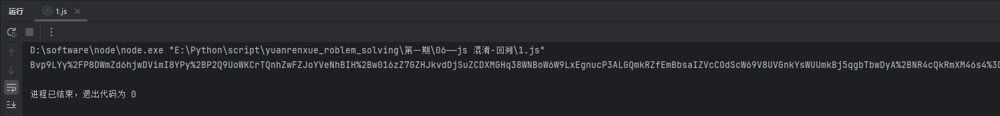

[js混淆-源码乱码](https://match.yuanrenxue.cn/match/1)

# 解题步骤

### 1.捕获相关请求

        通过网络界面可知，请求接口为：https://match.yuanrenxue.cn/api/match/6所以我们可以通过XHR/提取断点功能来捕获该请求，如下图，发现
    了接口所需的参数，m和q的构造逻辑，q是序号+时间戳，m是通过函数r传参时间戳和序号构成的：

### 2.代码分析

        通过观察代码发现是ras加密，但测试应该不是标准的加密，我们copy相应的代码，运行发现缺少window，我们需要补一下windwo（window=global）
    环境，然后发现ASN1也是未定义的，全局搜索一下发现window.ASN1 = u定义过的，但是为什么浏览器可以调用ASN1，而在node无法调用了呢，其实我们可
    以直接将ASN1添加window前缀，总计两个位置，这样就可以了，然后继续运行发现无报错，但是返回结果和自己预期的相差太大：

### 3.代码调试
        发现有个位置值和浏览器对不上，将jsfunck代码复制到浏览器发现返回的false，我们直接替换即可,顺便把window = {};注释掉，不然我们替换开头
    赋值的window会在这里被替换掉

### 4.代码运行
        运行结果如下：
