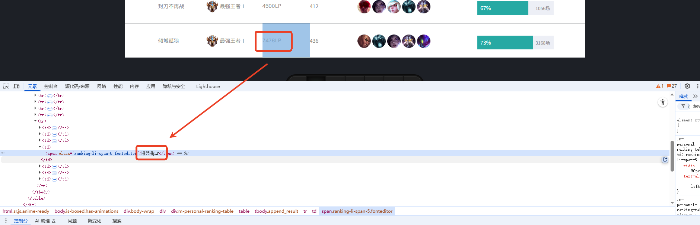
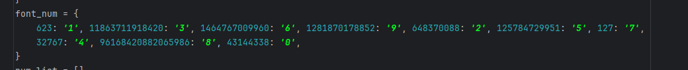
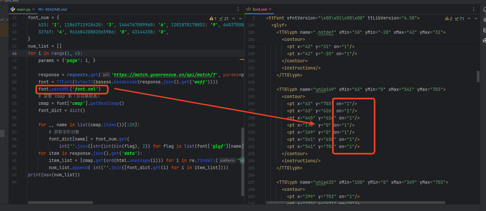

[字体查看](https://fontdrop.info/) 
[参考链接](https://blog.csdn.net/weixin_45091564/article/details/147741235)
# 解题步骤
### 1.捕获相关请求
        该接口无加密，cookie无动态，但是发现返回的值和页面展示区别很大，我们通过接口分析，发现是通过动态字体来展示相应数据的

## 2.问题思路
        既然是通过字体加密的，我们应该通过字体进行分析，字体分析连接已放开头，我们开始观察字体的规律，发现字体字形是变动的，无法通过最大最小x，y
    值来确定相应数字，然后百度发现了一个参考链接，发现每个坐标的状态值是固定的，故此采用坐标状态来做字典映射，下图为字典状态10进制数值对应的数字，
    （因为我觉得二进制太长了，所以用十进制来表示）

## 3.问题分析
        无
## 4.运行结果   
        无