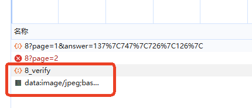
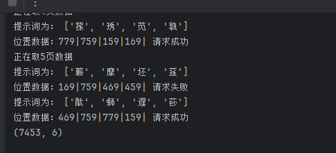

[参考链接](https://www.52pojie.cn/thread-1606710-1-1.html)

# 解题步骤
### 1.捕获相关请求
        通过捕获请求发现，跳转页面后会有一个8_verify请求发出，并返回一个html页面，解析html页面可以获得tip词和验证码图片，可知，需要通过点击验
    证码的正确位置才可以正常请求：

### 2.问题思路
        获取tip和验证码图片后，可以对验证码图片进行处理，白底，黑子，绿色干扰线（干扰线判断参考的上述连接），然后对干扰线进行单独处理，尽量补全字
    体，再对图片进行自行补全，再讲补全后的图片进行切割成3*3的图片，再将字体生成图片，使用图片hash比较来判断字体所在位置，获取位置后更具位置字典对
    照表获取所需的数值，
## 3.问题分析
        无
## 4.运行结果
